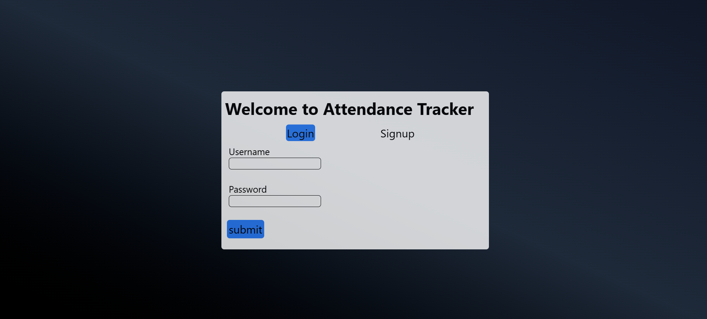
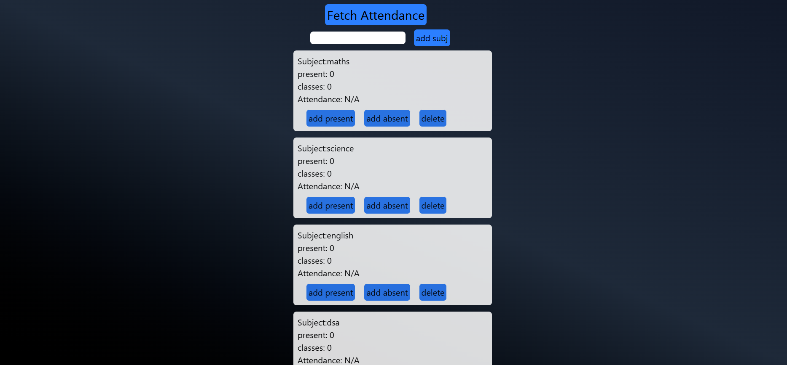

# Project Title
Attendance Tracker

##
A web application for students to track and manage attendance


## Features

- user authentication
- View attendance and percentage
- easy CRUD operation (add,view,delete,update) subjects
- user friendly interface

## Tech Stack

**Client:** React, Redux, TailwindCSS

**Server:** Node, Express

**Database:** MongoDB

## Description
a web application which allows user to login or signup with unique username.
- User can add or delete subject
- each subject contains add present,add absent
- view attendance statistic percentage per subject
## Screenshots
### Login/Signup Page

### Home Page



## Deployment

To deploy this project run

```bash
  git clone https://github.com/aerenyeger/attendance_tracker
```
#### Setup Frontend 

```bash
  cd attendance_tracker
```
```bash
  npm install
```
```bash
  npm run dev
```

#### Setup Backend, In new terminal  

```bash
  cd bd_attendance_tracker
```
```bash
  npm install
```
```bash
  node server.js
```

## Demo
#### Note:API call may take upto 60 sec
https://attendance-tracker-3uiu.onrender.com


